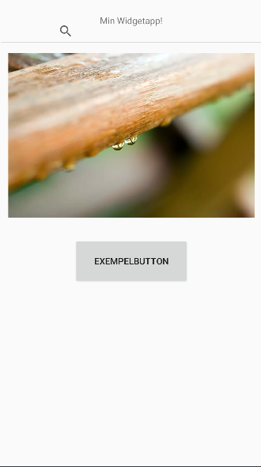

# Rapport

**Skriv din rapport här!**

_Du kan ta bort all text som finns sedan tidigare_.

## Följande grundsyn gäller dugga-svar:

- Ett kortfattat svar är att föredra. Svar som är längre än en sida text (skärmdumpar och programkod exkluderat) är onödigt långt.
- Svaret skall ha minst en snutt programkod.
- Svaret skall inkludera en kort övergripande förklarande text som redogör för vad respektive snutt programkod gör eller som svarar på annan teorifråga.
- Svaret skall ha minst en skärmdump. Skärmdumpar skall illustrera exekvering av relevant programkod. Eventuell text i skärmdumpar måste vara läsbar.
- I de fall detta efterfrågas, dela upp delar av ditt svar i för- och nackdelar. Dina för- respektive nackdelar skall vara i form av punktlistor med kortare stycken (3-4 meningar).

Programkod ska se ut som exemplet nedan. Koden måste vara korrekt indenterad då den blir lättare att läsa vilket gör det lättare att hitta syntaktiska fel.

```
function errorCallback(error) {
    switch(error.code) {
        case error.PERMISSION_DENIED:
            // Geolocation API stöds inte, gör något
            break;
        case error.POSITION_UNAVAILABLE:
            // Misslyckat positionsanrop, gör något
            break;
        case error.UNKNOWN_ERROR:
            // Okänt fel, gör något
            break;
    }
}
```

Bilder läggs i samma mapp som markdown-filen.


----------------------------------------------------------------------------------------------------

Först forkade och klonade jag GitHub-projektet till min egna dator så jag kan öppna projektet
i Android Studio. Sedan döpte jag om appen till "Widgets" i AndroidManifest.xml.
```xml
<resources>
    ...
    <string name="app_name">Widgets</string>
    ...
</resources>
```

När det var klart gick jag in i activity_main.xml för att skapa min design för appen. Jag valde att
använda en constraint layout då det redan fanns från början. Sedan lade jag till min första widget
som var en <imageView>, där jag använde en av standardbilderna som fanns i programmet från början.

```xml
<ImageView
        android:id="@+id/imageView2"
        android:layout_width="401dp"
        android:layout_height="257dp"
        android:layout_marginTop="16dp"
        android:contentDescription="@string/exempelbanner"
        app:layout_constraintEnd_toEndOf="parent"
        app:layout_constraintStart_toStartOf="parent"
        app:layout_constraintTop_toBottomOf="@+id/divider"
        tools:srcCompat="@tools:sample/backgrounds/scenic" />
```
```xml
<resources>
    ...
    <string name="exempelbanner">ExempelBanner</string>
    ...
</resources>
```

Jag lade även till en divider som delar innhållet på sidan mellan header och content. <searchView> 
och <imageView> är constraint vertikalt av dividern. Själva dividern (<View>) har constraint mot <textView>,
vilket betyder att allt påverkas beroende <textViews> position. 

```xml
<SearchView
        android:layout_width="252dp"
        android:layout_height="18dp"
        android:layout_marginBottom="8dp"
        app:layout_constraintBottom_toTopOf="@+id/divider"
        app:layout_constraintEnd_toEndOf="parent"
        app:layout_constraintHorizontal_bias="0.496"
        app:layout_constraintStart_toStartOf="parent" />
```
```xml
<TextView
        android:id="@+id/textView3"
        android:layout_width="wrap_content"
        android:layout_height="wrap_content"
        android:text="@string/min_widgetapp"
        app:layout_constraintBottom_toBottomOf="parent"
        app:layout_constraintLeft_toLeftOf="parent"
        app:layout_constraintRight_toRightOf="parent"
        app:layout_constraintTop_toTopOf="parent"
        app:layout_constraintVertical_bias="0.035" />
```
```xml
<resources>
    ...
    <string name="min_widgetapp">Min Widgetapp!</string>
    ...
</resources>
```
```xml
<View
        android:id="@+id/divider"
        android:layout_width="409dp"
        android:layout_height="1dp"
        android:layout_marginTop="24dp"
        android:background="?android:attr/listDivider"
        app:layout_constraintEnd_toEndOf="parent"
        app:layout_constraintStart_toStartOf="parent"
        app:layout_constraintTop_toBottomOf="@+id/textView3" />
```
Det enda som inte har constraint mot dividern är exempelknappen under <imageView> som är 
konstraint till <imageView>.

```xml
<Button
        android:id="@+id/button7"
        android:layout_width="180dp"
        android:layout_height="72dp"
        android:layout_marginTop="32dp"
        android:text="@string/exempelButton"
        app:layout_constraintEnd_toEndOf="parent"
        app:layout_constraintStart_toStartOf="parent"
        app:layout_constraintTop_toBottomOf="@+id/imageView2" />
```
```xml
<resources>
    ...
    <string name="exempelButton">exempelButton</string>
    ...
</resources>
```


Läs gärna:

- Boulos, M.N.K., Warren, J., Gong, J. & Yue, P. (2010) Web GIS in practice VIII: HTML5 and the canvas element for interactive online mapping. International journal of health geographics 9, 14. Shin, Y. &
- Wunsche, B.C. (2013) A smartphone-based golf simulation exercise game for supporting arthritis patients. 2013 28th International Conference of Image and Vision Computing New Zealand (IVCNZ), IEEE, pp. 459–464.
- Wohlin, C., Runeson, P., Höst, M., Ohlsson, M.C., Regnell, B., Wesslén, A. (2012) Experimentation in Software Engineering, Berlin, Heidelberg: Springer Berlin Heidelberg.
